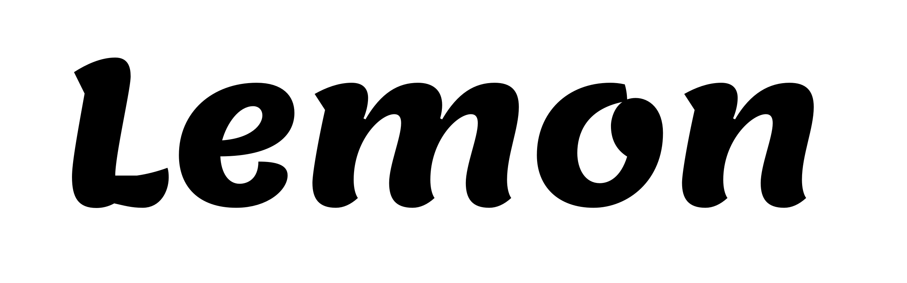
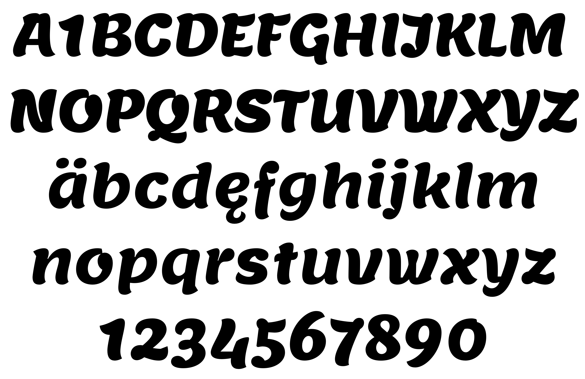

### Lemon

Lemon is a display typeface with soft and fluid shapes that come from painted street shop signage. The dark weight is ideal for headlines and short texts, and a future release of a lighter weight could be useful for longer text. The uppercase letters are very carefully drawn, making an attractive and unique design for text in all caps, compound words in capital letters, and acronyms. The same dynamic is inherent in the lowercase and numbers!

### Designer

* Eduardo Rodríguez Tunni

### License

Licensed under the [*SIL Open Font License, 1.1*](http://scripts.sil.org/OFL); you may not use this file except in compliance with the License.

To contribute to the project contact Eduardo Rodríguez Tunni > edu@tipo.net.ar
